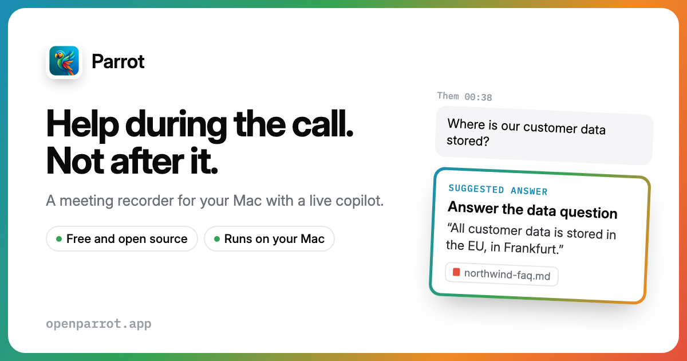
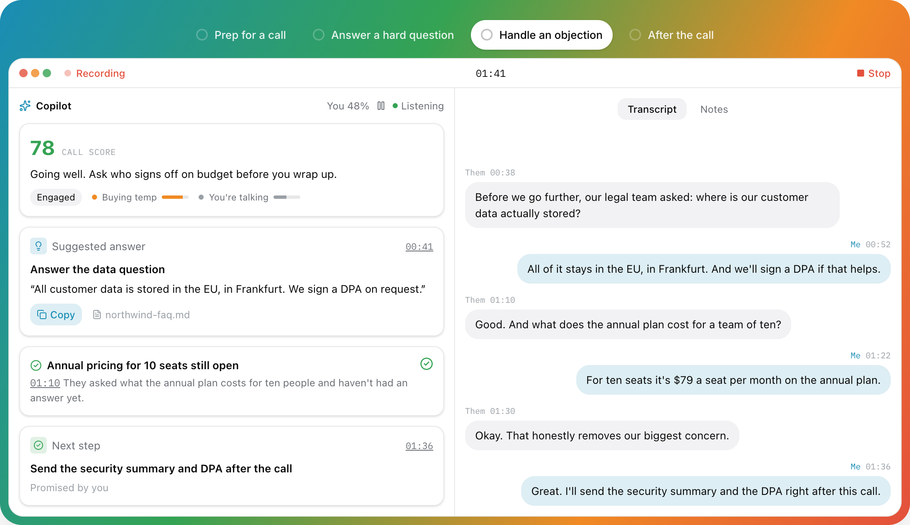
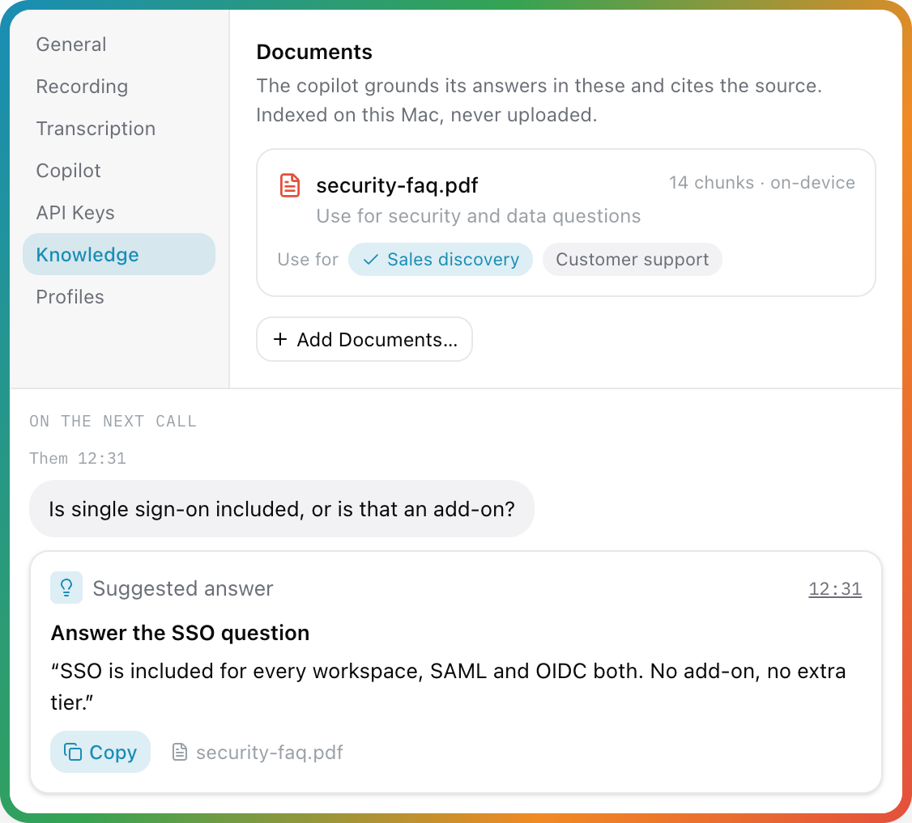
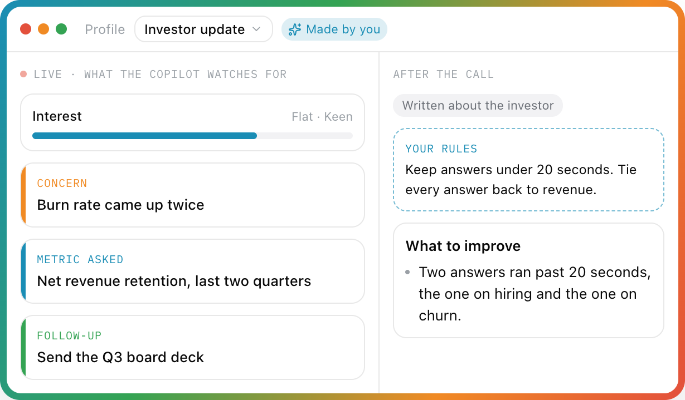
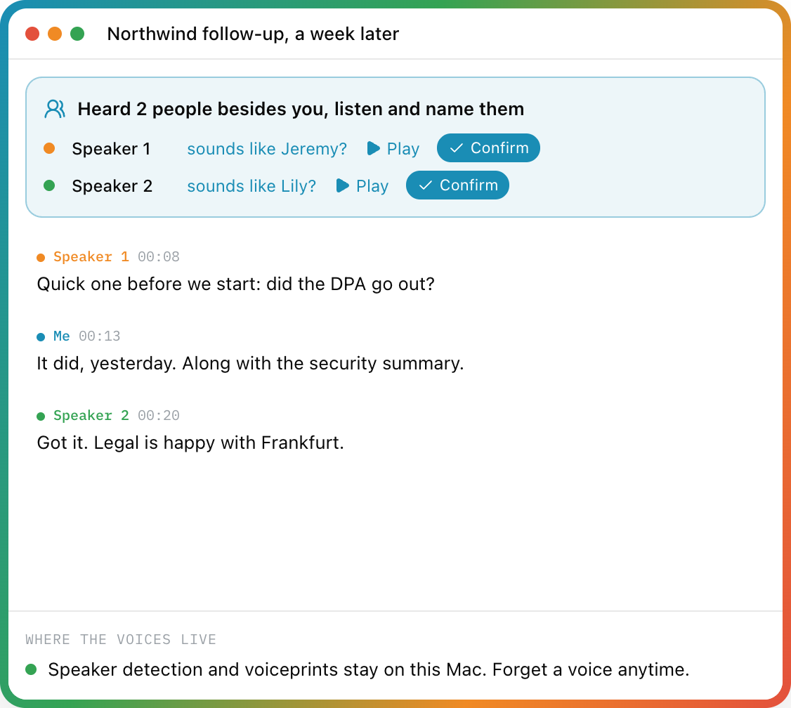
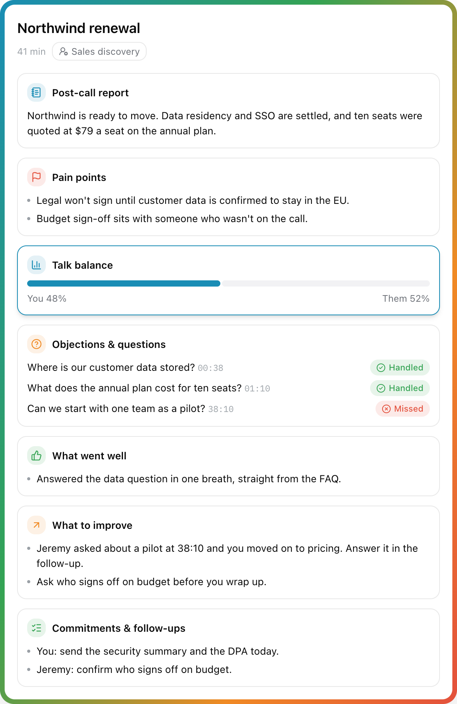
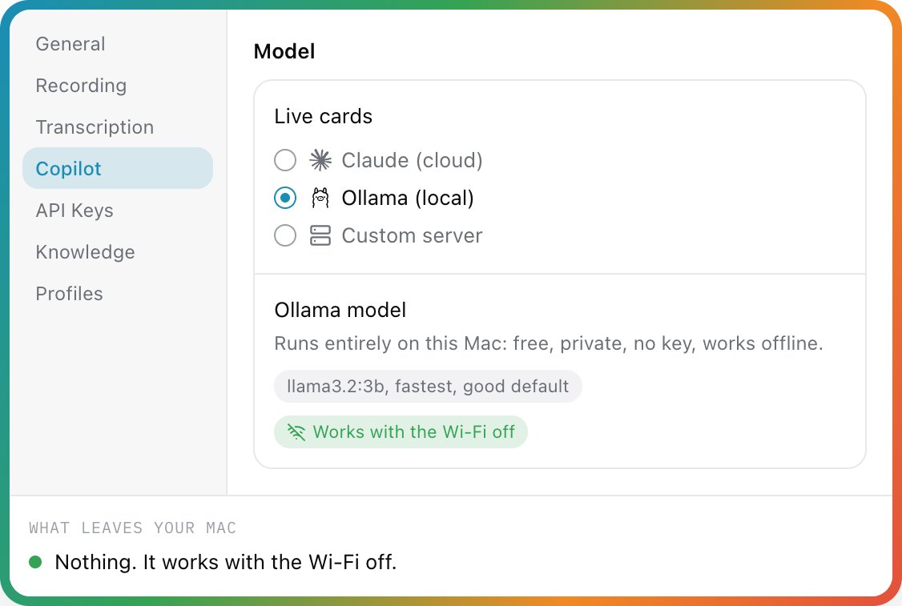
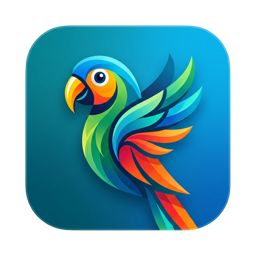

<a href="https://openparrot.app"></a>

<p align="center">
  <a href="https://github.com/turantekin/Parrot/releases"></a>
  
  <a href="LICENSE"></a>
  
  <a href="https://github.com/turantekin/Parrot/stargazers"></a>
</p>

<p align="center">
  <a href="https://openparrot.app"><b>Website</b></a> ·
  <a href="https://github.com/turantekin/Parrot/releases"><b>Download</b></a> ·
  <a href="https://turantekin.github.io/Parrot/help/"><b>User guide</b></a> ·
  <a href="https://github.com/turantekin/Parrot/discussions"><b>Discussions</b></a>
</p>

# 🦜 Parrot

**A meeting recorder for your Mac with a live AI copilot built in. It records and transcribes every call on your machine, suggests answers from your own documents while you're still talking, and writes the report before you've hung up.**

No bot joins your meeting. It works with Google Meet, Zoom, Teams, or anything else your Mac can hear. Transcription, speaker detection and your documents stay on your Mac. The copilot's brain is your choice: **Claude** with your own key, any OpenAI-compatible server, or a **local model through Ollama, which makes the whole thing free and offline**.



*The live call screen, as drawn on [openparrot.app](https://openparrot.app). The other side asked about data residency, and the answer came straight from the FAQ you dropped in.*

---

## Hey! 👋

So here's the deal. I'm Uygar, and I'm trying to build my own meeting recorder from scratch. I got tired of paying for services like Otter.ai that send all my conversations to some server I don't control. I thought, "How hard can it be to do this locally on my Mac?" Turns out... it's a journey. 😄

I'm building this with the help of [Claude](https://claude.ai) (yes, the AI, we've had a lot of late-night coding sessions together), and honestly, it's been one of the most fun projects I've worked on. It's not perfect yet: there are still bugs I'm chasing, permissions that are being annoying, and features I haven't figured out. But the core works, and it's on every one of my client calls now.

**This is a personal project. I'm learning as I go.** If there are any crazy coders out there who stumble upon this and want to help improve it, I would really, truly appreciate it. Fixing a bug, improving the speaker detection, or just telling me I'm doing something wrong: all of it helps. Open a PR, open an issue, or just say hi. 🙌

If you find this useful or just think the idea is cool, give it a star. It'll make my day.

## Contents

[What it does](#what-it-does) · [Privacy: what leaves your Mac](#privacy-what-leaves-your-mac) · [Getting started](#getting-started) · [Keyboard shortcuts](#keyboard-shortcuts) · [Tech stack](#tech-stack) · [Build from source](#build-from-source) · [Want to help?](#want-to-help-) · [Known issues](#known-issues-im-working-on-it) · [Similar projects](#similar-projects)

## What it does

### 🎯 Live Copilot: help during the call

An always-on assistant that watches the conversation and puts the right thing on screen. No button pressing, the whole call.

- **Suggested answers** the moment the other side asks something, grounded in *your* documents, with the file named on the card and a Copy button.
- **Pinned cards** for objections and open questions. They stay on screen until you handle them, then resolve themselves.
- **Next steps** captured the moment you promise them ("Promised by you").
- **A live call score** from 0 to 100, a one-line coach, a mood read, and gauges like *Buying temp* or *You're talking*. Your talk share turns orange past 70%.
- **Brief it before the call.** A line or two on the dashboard ("Renewal call, legal wants to know where the data is stored") and it knows who you're talking to from the first second. Edit the brief mid-call from the *Briefed* card.
- **You control what it spends.** Pace (Fast, Balanced, Relaxed for free tiers), how much conversation each request carries (2, 5 or 10 minutes), and a pause button on the call screen: while paused, nothing is sent and nothing is spent.
- **Answers from your docs in about half a second** (optional, Claude mode): add a TypeSafe AI key and the matching excerpt shows as a *From your docs* card while Claude is still writing.

### 📚 Knowledge base: brief it like a new teammate

<p align="center"></p>

- Drop in PDFs, text or Markdown: pricing sheets, FAQs, playbooks. They're chunked and embedded **on your Mac** with Apple's NaturalLanguage framework, plus an exact-word (BM25) index. Nothing is uploaded; only the few passages that match a question go to the copilot provider you picked.
- Give each document a note ("use for pricing questions") and tag it into the profiles that should use it.
- **Coaching instructions** for every call ("keep answers short, always offer three price options").
- Choose whether it may answer from **general knowledge** when your documents don't cover it. Every card says where its answer came from.

### 🔎 Ask Parrot: a memory of every call

Ask across all your calls (⌘K): *"What did I promise Acme?"*, *"What objections came up about pricing?"*. Every fact in the answer is a chip that opens the meeting at that second. Search runs on your Mac; with Ollama the answer is written there too. When a call starts with people you've met before, the Copilot's brief shows the open items from last time. And if you use Claude Desktop or another MCP app, you can let it read your meetings (read-only, off by default).

### 🎭 Call profiles: one app, every kind of call

<p align="center"></p>

Tell Parrot what kind of call it is, and the profile decides what the copilot watches for and how the report is written.

- **Seven built-ins:** Default, Sales discovery, 1:1 coaching, Interview, Customer support, Vendor call, Generic. Sales looks for objections and buying signals; Interview for follow-ups and red flags; a 1:1 gets reflections and open questions.
- **Make your own:** name it, say who the other side is, write a persona and rules, pick its documents, add your own card types (with color, icon, "keep on screen until handled") and gauges.

### 🗣️ Speaker names: names, not "Speaker 2"

<p align="center"></p>

- **Me vs Them is exact**, live: your mic and the call audio are separate tracks.
- **After the call, on-device speaker detection** ([FluidAudio](https://github.com/FluidInference/FluidAudio), a 13 MB model) tells the voices on the other side apart.
- **Name a voice once** from short clips and every line takes the name. Reports and coaching use real names.
- **Remember voices** (opt-in): next call, Parrot asks "sounds like Jeremy?" One click to confirm. Voiceprints stay on the Mac; forget one anytime.
- Got one line wrong? Right-click it and reassign just that line.

### 📝 The report writes itself, then it coaches you

<p align="center"></p>

- **Summary:** overview, pain points, key points, next steps.
- **Receipts on every point.** Each bullet carries a time chip (`12:34`): click it for the exact quote, *Play from Here* or *Show in Transcript*. Chips are checked against the transcript on your Mac, and a promise nobody actually made is marked *unverified* instead of stated as fact.
- **Moments you marked** during the call (the *Mark* button, or ⌃⌥M from any app) get their own card, and the report is written knowing they mattered.
- **Share it:** a follow-up email with only the promises actually made (opens in Mail, addressed to the invitees), next steps into Apple Reminders, Markdown notes into your Obsidian vault or any folder (automatically, if you like), or a webhook to Zapier/Make/n8n for Slack, Notion and CRMs.
- **Coaching:** talk balance, what went well, what to improve, objections and questions marked *Handled* or *Missed*, and commitments from both sides.
- **Per-call AI cost** down to the cent: model, tokens, calls and transcription minutes, with a line-by-line breakdown. Local features show $0.00, proudly.
- **Playback synced with the transcript** (0.5x to 2x): click a line, hear that moment.
- **Notes** you type during or after the call are kept with the meeting.

### 🧠 You pick the brain

<p align="center"></p>

| Copilot and reports | What it is | What leaves your Mac |
|---|---|---|
| **Claude** (`claude-haiku-4-5`) | Sharpest cards. Your own key. About $0.07 per call hour. | Transcript text, to Anthropic. Never audio. |
| **Ollama** (local) | `llama3.2:3b`, `gemma3:4b`, or any model you like. Parrot can pull it for you. Free. | Nothing. Works with the Wi-Fi off. |
| **Custom server** | Anything OpenAI-compatible: OpenAI, Gemini, Groq, OpenRouter, LM Studio. | Transcript text, to the server you picked. |

Live cards and post-call reports can use different brains (say, Ollama live and Claude for the report).

| Transcription | Why pick it | ~Cost per call hour (both sides) |
|---|---|---|
| **On-device Whisper** (default) | Private, offline, free. Five models from Tiny (40 MB) to Large V3 Turbo (1.6 GB). | Free |
| **Groq** `whisper-large-v3-turbo` | Big-model accuracy, same latency as local. | ~$0.08 |
| **Deepgram** Nova-3 | True streaming, words appear ~300 ms after they're spoken. | ~$0.70 ($0.58 with one language pinned) |

Cloud engines fall back to on-device automatically if anything fails mid-call. An optional **polish pass** re-transcribes the saved audio with Groq's large model after you hit Stop and rewrites the report from the cleaner text.

### 🌍 Your language, too

Whisper auto-detects the language of the call, or you can pin one of 14 (English, Turkish, Spanish, German, French, Italian, Portuguese, Dutch, Russian, Arabic, Hindi, Chinese, Japanese, Korean). The copilot and the report answer in the language of the call. Documents work in most major languages, including Turkish, Dutch, Polish, Russian, Arabic, Hindi, Chinese, Japanese and Korean, and an English question can find the answer in a Turkish or Spanish document. For anything but English, pick Large V3 Turbo or Groq. A **custom vocabulary** list teaches Whisper your product and people names.

### 🧰 And all the everyday stuff

- **Notices your calls.** When Zoom, Meet, Teams or FaceTime starts using the mic, Parrot asks *"Record it?"* (or records on its own, if you choose) and offers to stop when the call ends. It only sees that the mic is in use, never another app's audio.
- **Knows your calendar** (opt-in, read-only, local): meetings take their event's name and guest list, guests become one-click speaker names, and an event title like "Interview: Jane" picks the matching profile.
- **Opens at login**, if you like, so it's there for the first call of the day.
- **Records system audio and your mic** as two tracks. On macOS 15+ it uses the audio-only System Audio permission (Core Audio taps); on macOS 14, ScreenCaptureKit. No virtual audio drivers.
- **Echo cancellation** (SpeexDSP) so the other side doesn't leak into your mic on speakers. The mic reconnects by itself when AirPods die or switch mid-call.
- **Sentences, not fragments.** Lines land as whole sentences when the speaker pauses, with a live grey preview while they're still talking. Silence is never transcribed.
- **Never loses a meeting.** If Parrot crashes or gets force-quit mid-call, the recording is recovered with its transcript and report on next launch. ⌘Q mid-call finishes the recording first.
- **Forgot to hit stop?** After 15 minutes with nobody talking, Parrot asks *Still recording?* An idle room isn't turned into words, and if you want the tail gone anyway, right-click a line and choose *Delete Everything After This Line*. The audio is kept in full.
- **Import recordings.** Drop an audio file (m4a, mp3, wav, aac, aiff, caf) on the window and it's transcribed, split by speaker and summarised like a live call.
- **Export** a meeting as TXT (notes, report, copilot cards and transcript in one file) or SRT subtitles.
- **Searchable history.** Search titles and transcripts, meetings grouped by day, with a talk-ratio strip on each.
- **Menu bar item** to start and stop from anywhere, and a dashboard with your meetings, hours and words.
- **Keeps itself up to date** with signed Sparkle updates that install when you quit, never during a recording.
- **A real user guide** inside the app (Help > Parrot Help, searchable and offline), also [on the web](https://turantekin.github.io/Parrot/help/).
- **Bug reports in two clicks.** The ladybug in the corner writes the boring parts (version, model, settings) and hands you a pre-filled GitHub issue to check and post yourself.
- Light and dark mode, native SwiftUI, no Electron.

## Privacy: what leaves your Mac

This is a microphone-and-system-audio app, so you shouldn't have to take my word for anything. Here's everything that can leave the machine, and when:

| Feature | Sends | To | When |
|---|---|---|---|
| Recording, on-device transcription, speaker detection, voiceprints, document index | Nothing | No one | Always local |
| Model downloads | A download request | Hugging Face (Whisper, voice-detection and speaker-detection models); Apple (language model for Arabic, Indic and some Cyrillic documents) | Once, first use |
| Update check | The app's version | GitHub Pages (Sparkle feed) | Once a day; can switch off auto-install |
| Copilot on Claude or a custom server | Transcript text, matched document passages, profile instructions | Anthropic, or the server you picked | Only if you turn Copilot on |
| TypeSafe doc answers | The question, a couple of lines of context, candidate document snippets | TypeSafe AI | Only with a TypeSafe key, Claude mode |
| Groq or Deepgram transcription, polish pass | Call audio | Groq or Deepgram | Only if you pick that engine |
| Calendar | Nothing (read locally through macOS's calendar store) | No one | Only if you connect it |
| Calendar invite for the Copilot | Event title, guest names, notes (dial-in details removed) | Anthropic, or the server you picked | Only if you turn on "Brief the copilot from the invite" |
| Call detection | Nothing (asks macOS which apps use the mic) | No one | Unless you turn it off |
| Ask Parrot | The few best-matching excerpts | Your reports AI | Only with a cloud reports AI; nothing with Ollama |
| Follow-up email | The meeting's transcript | Your reports AI | Only when you draft one |
| Webhook | Summary, next steps, notes (transcript if allowed) | The address you paste | Only if you set one; never for on-device-only meetings |
| AI apps (MCP) | Whatever the app reads when you ask it | That app (often its cloud) | Only if you turn it on; never on-device-only meetings |
| Copilot on Ollama | Nothing | Your own Mac | Always local |

- **On-device only, one switch** (or per profile, say for therapy or legal calls): Whisper and Ollama only, and the meeting stays out of every cloud path afterwards. Optional **redaction** hides emails, phone, card and bank numbers (and names, if you like) from cloud AI and restores them in the answer. A **consent** button records how people were told, and **automatic clean-up** deletes old audio or meetings. Each meeting shows exactly *what left this Mac*.
- **No accounts, no telemetry, no analytics.** There's no Parrot server to phone home to.
- **Keys live in your macOS Keychain**, never in files or logs.
- **Signed and notarized.** Releases are Developer ID-signed and Apple-notarized; updates are EdDSA-signed.
- **Small and auditable.** About 17k lines of Swift with three dependencies (WhisperKit, FluidAudio, Sparkle) plus a vendored SpeexDSP echo canceller. [FILEMAP.md](FILEMAP.md) maps every source file, so an afternoon of reading covers the lot.
- **Honest about the process.** The code is written with heavy AI assistance (Claude Code) under human direction, and every change runs a 300+ check logic harness plus visual snapshot checks before it lands.

Found something that contradicts any of this? That's a security issue, see [SECURITY.md](SECURITY.md).

## Getting started

> 📖 **[Parrot Help](https://turantekin.github.io/Parrot/help/)** walks through every feature. The same pages ship inside the app under **Help > Parrot Help**.

1. **Download** the notarized `.dmg` from the **[Releases page](https://github.com/turantekin/Parrot/releases)** (or the button on [openparrot.app](https://openparrot.app)) and drag Parrot into Applications. Needs macOS 14 (Sonoma) or later on Apple Silicon.
2. **Allow two permissions.** The welcome tour shows live status for each and deep-links to the right Settings pane:
   - **System Audio Recording** for the other side of the call. On macOS 15+ this is the audio-only permission. On macOS 14 it's Screen Recording instead (that's how older macOS exposes system audio; Parrot only ever captures audio) and takes effect after you reopen Parrot.
   - **Microphone** for your side.
3. **Pick a Whisper model.** It downloads once, with a progress bar:

   | Model | Size | Good for |
   |---|---|---|
   | Tiny | 40 MB | Fastest |
   | Base | 140 MB | A good default |
   | Small | 460 MB | Better accuracy |
   | Large V3 Turbo Compressed | 626 MB | Near-best, low memory. The sweet spot |
   | Large V3 Turbo | 1.6 GB | Best accuracy, and best for non-English calls |

4. **Hit record** on your next call. That's it for a private recorder. For the copilot:
5. **Turn on the Copilot** (optional) in **Settings > Copilot**: pick Claude (paste a key from [console.anthropic.com](https://console.anthropic.com) under Settings > API Keys), Ollama ([install it](https://ollama.com), Parrot pulls the model), or your own server.
6. **Feed it your knowledge** (optional) in **Settings > Knowledge**, and pick or build a profile in **Settings > Profiles**.

Want the tour again? **Help > Show Welcome Tour**.

## Keyboard shortcuts

| Shortcut | Does |
|---|---|
| ⌘R | Start recording |
| ⌘. | Stop recording |
| ⌘O | Import an audio file |
| ⌘E | Export transcript (TXT) |
| ⌘F | Search meetings |
| ⌘, | Settings |

## Tech stack

| What | How |
|------|-----|
| UI | SwiftUI, native macOS, Inter |
| Speech-to-text (default) | [WhisperKit](https://github.com/argmaxinc/WhisperKit), on-device on the Neural Engine |
| Speech-to-text (optional, your key) | Groq `whisper-large-v3-turbo` (HTTP chunks) · Deepgram Nova-3 (websocket streaming) |
| Voice detection | Silero VAD (MIT) via FluidAudio, on-device: only clips with a voice in them reach Whisper, so an idle room stays blank |
| Speaker detection | [FluidAudio](https://github.com/FluidInference/FluidAudio) (Apache-2.0), on-device pyannote-derived models (CC-BY-4.0) |
| Copilot and reports | Claude API (Haiku 4.5, structured outputs) · Ollama · any OpenAI-compatible server |
| Instant document answers (optional) | TypeSafe AI `jev-latest` |
| Knowledge base | Apple NaturalLanguage contextual embeddings + BM25, all on-device |
| System audio | Core Audio process taps (macOS 15+) · ScreenCaptureKit (macOS 14) |
| Microphone | AVAudioEngine + vendored SpeexDSP echo canceller |
| Storage | SwiftData; API keys in the Keychain |
| Updates | [Sparkle](https://sparkle-project.org), EdDSA-signed appcast |
| Project | [XcodeGen](https://github.com/yonaskolb/XcodeGen): `project.yml` is the source of truth |

## Build from source

Prerequisites: macOS 14.0+, Apple Silicon recommended, and an Xcode / Swift toolchain.

```bash
git clone https://github.com/turantekin/Parrot.git
cd Parrot
make run
```

`make run` compiles with `swift build`, assembles `dist/Parrot.app`, signs it with whatever identity you already have (ad-hoc if none), and launches it. `make help` lists the rest (`make test`, `make install`, `make clean`...).

- **Build with `make`, not Xcode's UI.** Xcode's explicit-modules build intermittently races on WhisperKit's dependencies. `make xcode` regenerates the project from `project.yml` if you want the IDE; keep the actual builds on `make`.
- **Permissions and rebuilds.** macOS ties the audio and microphone grants to the signing identity, so ad-hoc builds re-ask after every rebuild. `make signing-help` shows two free ways to make them stick.
- **Finding your way:** [FILEMAP.md](FILEMAP.md) has one line per source file; [AGENTS.md](AGENTS.md) has the layout and conventions; [CONTRIBUTING.md](CONTRIBUTING.md) is the human orientation.

## What's next (my wishlist)

- [x] **Real speaker diarization.** Done, on-device, with naming and remembered voices
- [x] **Local LLM for summaries and copilot.** Done, through Ollama (an in-process MLX model may still come one day)
- [x] **Notarize and distribute.** Done, notarized DMG plus Sparkle auto-updates
- [x] **Pre-call brief and per-call profiles.** Done
- [ ] **Live speaker names during the call**, not just after it
- [x] **Calendar integration.** Done: meetings take their event's name and guests
- [x] **Bookmarks.** Done: mark moments mid-call (⌃⌥M from any app), and every report point links to its source
- [ ] **Better waveform visualization.** The current one is... functional

If any of these excite you, jump in!

## Want to help? 🙏

Seriously, if you're into Swift/macOS development, audio processing, or on-device ML, I'd love your help. I'm one person building this in my spare time with Claude as my coding buddy, and there's a lot I don't know yet.

- **Speaker detection.** Overlapping speech and very similar voices can still fool it, and live labels during the call are still cooking.
- **Permission edge cases.** Core Audio taps have no permission-status API (an unauthorized tap just delivers silence). If you know TCC quirks around `kTCCServiceAudioCapture`, I want to hear from you.
- **Bug fixes.** Found something broken? Open a PR, I'll review it quickly.
- **Feature ideas.** [Open an idea](https://github.com/turantekin/Parrot/issues/new/choose) or start a [discussion](https://github.com/turantekin/Parrot/discussions).
- **Just vibes.** Even "cool project" or "this is dumb, do it this way instead". I'm all ears.

The easiest way to report anything: click the little ladybug in the bottom right corner of the app (or **Help > Report a Bug...**). Start with [CONTRIBUTING.md](CONTRIBUTING.md), and please be kind ([Code of Conduct](CODE_OF_CONDUCT.md)). Stuck? See [SUPPORT.md](SUPPORT.md).

## Known issues (I'm working on it)

- **Audio permissions reset on ad-hoc source builds.** Identity-less builds look like a new app every time. `make signing-help` shows two fixes. Downloaded release builds keep the grant across updates.
- **Models need internet once.** Whisper, voice-detection and speaker-detection models download on first use, and macOS fetches a language model the first time you add an Arabic, Indic or (on some Macs) Cyrillic document. After that, everything runs offline.
- **Speaker detection isn't perfect.** Me vs Them is exact (separate tracks). Similar voices or heavy crosstalk on the other side can still get a line wrong; right-click it to reassign.
- **Mic bleed on speakers.** Without headphones, a loud call can still leak into your mic now and then. Headphones fix it.

## Similar projects

Parrot isn't alone in the "no cloud, no bots, just transcribe my meeting" corner. If you're evaluating approaches, read all of these:

- [Meetily](https://github.com/Zackriya-Solutions/meetily): local Whisper/Parakeet transcription with Ollama summaries (Rust)
- [Hyprnote](https://github.com/fastrepl/hyprnote): privacy-first meeting notepad, mic + system audio, on-device models
- [screenpipe](https://github.com/mediar-ai/screenpipe): continuous local screen and audio capture with local Whisper

Parrot's angle: fully native SwiftUI + WhisperKit, and a *live* in-call copilot grounded in your own documents, rather than only post-call notes.

## License

GPL-3.0. Use it, learn from it, improve it. If you ship a modified version, it has to stay open source under the same license.

Releases up to and including v0.11.3 were published under MIT and remain MIT.

---

<p align="center"><a href="https://openparrot.app"></a></p>

<p align="center"><i>Built with SwiftUI, WhisperKit, and way too many late-night <a href="https://claude.ai">Claude Code</a> sessions. 🌙<br>If you've also tried to build something stupid-ambitious as a personal project: I see you. Keep going. 🦜</i></p>
