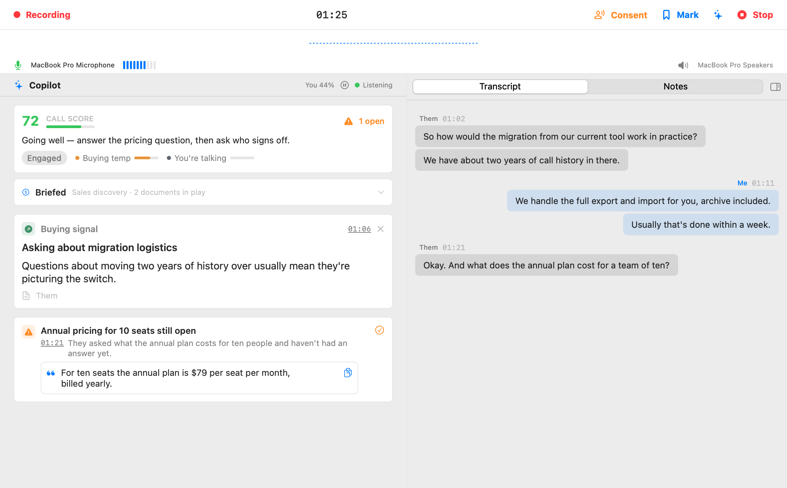

# 🦜 Parrot

**A live AI copilot for your calls that runs on your Mac — and never sends your calls anywhere.**

While you're on a Google Meet, Zoom, or any call, Parrot listens along and helps in real time: when the other side asks something, a suggested answer appears — grounded in *your* documents, your pricing, your FAQ. Objections get pinned on screen until you've handled them. Action items are captured the moment you promise them. A live score and a one-line coach tell you how the call is going while it's still going. And when you hang up, the report is already being written.

Underneath it is a fully private recorder: on-device transcription (WhisperKit), both sides of the call, no cloud, no account, no data leaving your machine. The copilot's brain is your choice — **Claude** with your own key, or a **local model through Ollama, which makes the entire thing free and offline**. Either way you get a pause button, pace controls, and a per-call cost breakdown down to the cent.



*A demo call, but a real screen: the pinned card is answering the pricing question the other side just asked. [The full guide is here.](https://turantekin.github.io/Parrot/help/)*

---

## Hey! 👋

So here's the deal — I'm Uygar, and I'm trying to build my own meeting recorder from scratch. I got tired of paying for services like Otter.ai that send all my conversations to some server I don't control. I thought, "How hard can it be to do this locally on my Mac?" Turns out... it's a journey. 😄

I'm building this with the help of [Claude](https://claude.ai) (yes, the AI — we've had a lot of late-night coding sessions together), and honestly, it's been one of the most fun projects I've worked on. It's not perfect yet — there are still bugs I'm chasing, permissions that are being annoying, and features I haven't figured out. But the core works: it captures audio, transcribes in real-time using WhisperKit, and keeps everything on your machine.

**This is a personal project. I'm learning as I go.** I'm sharing it publicly because why not? If there are any crazy coders out there who stumble upon this and want to help improve it, I would really, truly appreciate it. Whether it's fixing a bug, improving the speaker detection, or just telling me I'm doing something wrong — all of it helps. Open a PR, open an issue, or just say hi. 🙌

If you find this useful or just think the idea is cool, give it a star. It'll make my day.

## What It Does

- **Records system audio + microphone** — Captures what everyone says in a meeting (via ScreenCaptureKit) plus your own voice
- **Knows who said what** — On-device speaker detection tells the people on the call apart. Name each voice once from short clips, and the transcript, reports, and coaching all use real names. Turn on **Remember voices** and Parrot suggests who's talking on the next call. Free and fully local. (Meetily charges $10/month for diarization; Anarlog $15/month, via the cloud.)
- **Real-time transcription, your choice of engine** — On-device WhisperKit by default (private, free). Or bring your own key for **Groq** (big-model accuracy for ~$0.04/hr) or **Deepgram** (true streaming — words appear ~300 ms after they're spoken). Cloud engines fall back to on-device automatically if anything fails mid-call
- **Transcripts read like people talk** — Lines land as whole sentences when the speaker pauses (not chopped 2-second fragments), with a live preview filling in while they're still mid-sentence. Silence is never transcribed
- **Post-call polish pass (optional)** — After you hit Stop, re-transcribe the whole call through Groq's large model and regenerate the reports from the cleaner text, for pennies
- **Live Call Copilot** — An always-on assistant that watches the conversation: a live coach card with a 0–100 "how is this call going" score, suggested answers grounded in *your* documents, pinned blocker/question cards that auto-resolve when you handle them, and action items captured as you promise them. Opt-in, and you pick the brain: **Claude** (bring your own key), a **local model via Ollama** (fully offline AI), or any OpenAI-compatible server. Transcript text goes to your chosen provider, audio never leaves your Mac
- **You control what the Copilot spends** — A pace setting (Relaxed fits free model tiers), a dial for how much conversation each request carries, and a pause button right on the call screen: while paused, nothing is sent and nothing is spent
- **Call Profiles** — Reshape the copilot per call type (sales discovery, 1:1 coaching, interviews…): each profile has its own insight kinds, sentiment gauges, persona, and tone
- **Per-call AI cost transparency** — Every meeting shows what the AI actually cost: model, tokens, calls, transcription minutes, and estimated dollars, with a line-by-line breakdown. Local features show $0.00, proudly
- **Knows who's talking** — Your mic is transcribed as "Me" and system audio as "Them", live and with zero ML guesswork; energy-based diarization then refines who's who within "Them" after the call
- **Post-call reports** — AI summary with pain points, plus a coaching report: talk ratio, what went well, what to improve, objections handled vs missed, and commitments
- **Per-call notes** — Type notes live during the call (side panel) and edit them later; stored with the meeting
- **Playback synced with the transcript** — Click a transcript line, hear that moment
- **Import existing recordings** — Drop an audio file (m4a, mp3, wav, aac…) onto the app and it's transcribed, diarized, and summarized like any live meeting
- **Doesn't lose your meeting** — If the app crashes or gets force-quit mid-call, the recording is recovered with its transcript and reports on next launch. AirPods dying mid-call no longer kill the mic either
- **Searchable history, export, menu bar extra, dark mode** — Meetings stored locally, TXT/SRT export, quick start/stop from the menu bar

## Tech Stack

| What | How |
|------|-----|
| UI | SwiftUI, native macOS (no Electron!) |
| Speech-to-Text (default) | [WhisperKit](https://github.com/argmaxinc/WhisperKit) — on-device, runs on Neural Engine |
| Speech-to-Text (optional, BYO key) | Groq `whisper-large-v3-turbo` (HTTP chunks) · Deepgram Nova-3 (websocket streaming) |
| Speaker detection | [FluidAudio](https://github.com/FluidInference/FluidAudio) (Apache-2.0) — on-device pyannote-derived models (CC-BY-4.0), ~13 MB downloaded on first use |
| Copilot & reports (optional, BYO key) | Claude API (Haiku) with structured outputs |
| Knowledge base | Apple NaturalLanguage embeddings — documents chunked & embedded on-device, never uploaded |
| System Audio | ScreenCaptureKit (no virtual audio drivers needed) |
| Microphone | AVAudioEngine |
| Storage | SwiftData + SQLite |
| Project | [xcodegen](https://github.com/yonaskolb/XcodeGen) — `project.yml` is the source of truth |
| Target | macOS 14.0+ (Sonoma and later) |

## Screenshots

The post-call report — summary, coaching, and commitments as section cards:


| Live Copilot during a call | Live transcript | Meeting history |
|---|---|---|
|  |  |  |

*Rendered by the app's own snapshot harness with demo data — these are the real views the code draws, not mockups.*

## Why Trust an App That Hears Your Calls?

Fair question — this is a microphone-and-system-audio app, and you shouldn't have to take my word for anything. The properties you can check yourself:

- **Local by default.** Out of the box there is exactly one network call in the whole app: a once-a-day GitHub check for new releases. Transcription, diarization, embeddings, reports — all on-device.
- **Cloud features are opt-in, with your own keys.** Groq/Deepgram transcription and the Claude copilot only exist after you paste your key, and they're labelled with exactly what they send (transcript text — audio never leaves the Mac). Keys live in your Keychain, not in files.
- **No accounts, no telemetry, no analytics.** There's no server for Parrot to phone home to.
- **Small and auditable.** ~13k lines of Swift, two real dependencies (WhisperKit, plus a vendored SpeexDSP echo canceller). [FILEMAP.md](FILEMAP.md) maps every source file so an afternoon of reading covers the whole thing.
- **Signed and notarized.** Releases are Developer ID-signed and Apple-notarized — what you download is what was built.
- **Honest about the process.** The code is written with heavy AI assistance (Claude Code) under human direction, and every change runs a ~94-check logic harness plus visual snapshot verification before it lands. Outside PRs get read line by line — ask [@wkoszek](https://github.com/wkoszek).

Found something that contradicts any of this? That's a security issue — see [SECURITY.md](SECURITY.md).

## Getting Started

> 📖 There's a proper user guide now — **[Parrot Help](https://turantekin.github.io/Parrot/help/)** — with a walkthrough of every feature. The same pages ship inside the app under **Help → Parrot Help**, searchable and offline.

### Download (the easy way)

Grab the latest notarized `.dmg` from the **[Releases page](https://github.com/turantekin/Parrot/releases)**, drag Parrot into Applications, and hit record. No Xcode, no build step. Requires macOS 14+ (Sonoma) on Apple Silicon.

*It's an early beta — if something breaks, please open an issue. That genuinely helps.*

### Build from source

Prerequisites: macOS 14.0+, Apple Silicon recommended, and an Xcode / Swift 5.9+ toolchain.

```bash
git clone https://github.com/turantekin/Parrot.git
cd Parrot
make run
```

`make run` compiles with `swift build`, assembles `dist/Parrot.app`, signs it with whatever identity you already have (ad-hoc if none), and launches it. `make help` lists the rest (`make test`, `make install`, `make clean`…).

Two things worth knowing:

- **Build with `make`, not Xcode's UI** — Xcode's explicit-modules build intermittently races on WhisperKit's transitive dependencies. If you want the IDE anyway, `make xcode` regenerates the project from `project.yml`; keep the actual builds on `make`.
- **Permissions and rebuilds** — macOS ties the Screen Recording and Microphone grants to the signing identity, so ad-hoc builds re-ask after every rebuild. `make signing-help` shows two free ways to make them stick.

### Permissions

On first launch, Parrot walks you through the two permissions it needs:
1. **System Audio Recording** — the other side of the call. On macOS 15+ this is the audio-only permission (Core Audio process tap): no screen-content rights, no periodic "Parrot is recording your screen" re-confirmations. On macOS 14 it's the classic Screen Recording permission instead — that's simply how older macOS exposes system audio; Parrot only ever captures audio, never screen content
2. **Microphone** — your side of the call

The onboarding page shows live status for both and deep-links to the exact Settings panes. On macOS 14, one quirk to know: Screen Recording takes effect when the app restarts — if the row doesn't turn green after you grant it, quit and reopen Parrot (onboarding picks up right where you left off). On macOS 15+ no restart is needed; the row confirms itself the first time Parrot hears meeting audio. And if you ever want the walkthrough again, it's one click away: Help → Show Welcome Tour.

### Choose a Model

Parrot uses WhisperKit models for transcription. Pick one during onboarding:

| Model | Size | Speed | Accuracy |
|-------|------|-------|----------|
| tiny | ~40 MB | Fastest | Basic |
| base | ~140 MB | Fast | Good |
| small | ~460 MB | Moderate | Better |
| large-v3-turbo compressed | ~626 MB | Moderate | Near-best |
| large-v3-turbo | ~1.6 GB | Slower | Best |

The model downloads automatically on first use, with a progress bar so you can
see it happening. `base` is a good default; the compressed turbo is the sweet
spot if you want accuracy without the memory.

### Or pick a cloud transcription engine (optional)

In **Settings → Transcription** you can trade "audio never leaves the Mac" for accuracy or speed — bring your own key, pay the provider directly:

| Engine | ~Cost (1-hr call, both tracks) | Why pick it |
|--------|-------------------------------|-------------|
| On-device Whisper | free | Private. The default. |
| Groq | ~$0.08 | Large-model accuracy, same latency as local |
| Deepgram | ~$0.58 | True streaming — words appear as they're spoken |

There's also a **"Polish transcript after each call"** toggle (needs a Groq key): re-transcribes the saved audio with the large model after you hit Stop and regenerates the reports from the cleaner text (~$0.04 per call hour). Whatever you use, the meeting header shows the estimated cost afterwards.

### Enable the Live Call Copilot (optional)

The Copilot watches the live transcript during a recording and pushes suggested answers, blockers, and action items into a side panel — automatically, the whole call, no button pressing.

1. Get a Claude API key from [console.anthropic.com](https://console.anthropic.com)
2. Open **Settings → Copilot**, paste the key (stored in your keychain), and flip the toggle
3. Start a recording — the Copilot panel appears next to the live transcript

**Privacy note:** Copilot sends transcript *text* to Anthropic's API to generate suggestions. Your audio never leaves your Mac, and nothing is sent unless you enable the feature. It runs on Claude Haiku, so a full hour-long call costs only a few cents.

### Give the Copilot your knowledge (optional but powerful)

In **Settings → Knowledge** you can brief the copilot like you'd brief a new teammate:

- **Drop in documents** — pricing sheets, FAQs, playbooks (PDF/text/markdown). They're chunked and embedded **on this Mac** (Apple's NaturalLanguage framework — documents are never uploaded). When a question comes up on a call, the copilot grounds its suggested answer in the best-matching passages and cites the source on the card. Each document takes an optional note like *"use for pricing questions"*.
- **Coaching instructions** — standing guidance for every call: tone, style, behavior ("keep answers short and casual, always offer Good/Better/Best on price").
- **General-knowledge fallback** — choose whether the copilot may answer beyond your documents. Cards always show where an answer came from: your document's name or *"general knowledge"*.
- **Pre-call brief** — an optional one-liner on the dashboard before you hit record ("Call with Westfield PM about AC replacement") so the copilot has context from second one.

## Project Structure

```
Parrot/
  ParrotApp.swift              # App entry point (+ CLI harness flags)
  Models/
    Meeting.swift              # Meeting data model (SwiftData)
    TranscriptSegment.swift    # Individual transcript segments
    Insight.swift              # Copilot insight cards
    CallProfile.swift          # Per-call-type copilot configuration
    KnowledgeBase.swift        # Embedded document chunks
    AIUsage.swift              # Per-call usage/cost snapshot + pricing table
  Services/
    AudioCaptureManager.swift  # System audio + mic capture (+ echo cancel)
    TranscriptionEngine.swift  # Backend seam: local Whisper loop + cloud routing
    CloudTranscription.swift   # Groq + Deepgram backends, polish pass
    DiarizationEngine.swift    # Speaker refinement within "Them"
    CallAnalysisEngine.swift   # Live copilot loop (triggers, dedup, sentiment)
    AnalysisProvider.swift     # Claude API client + usage metering + Keychain
    KnowledgeBaseService.swift # On-device embedding + retrieval
    RecordingManager.swift     # Orchestrates everything
    ExportService.swift        # TXT/SRT export
  Views/
    ContentView.swift          # Main navigation
    DashboardView.swift        # Landing page with record button
    LiveRecordingView.swift    # Copilot center stage + chat-bubble transcript + notes
    CopilotPanelView.swift     # Coach card, pinned cards, insight feed
    MeetingDetailView.swift    # Report/transcript/insights/notes tabs + cost row
    SettingsView.swift         # Copilot, Transcription, Knowledge, Profiles
    Theme.swift                # Design tokens (colors, typography)
    ...
  ProfileTest.swift            # `--profile-test` logic harness (~60 checks)
  SnapshotTool.swift           # `--snapshot` / `--copilot-snapshot` offscreen renders
```

The full per-file map (with line counts) lives in [FILEMAP.md](FILEMAP.md); conventions and layout for tooling and coding agents are in [AGENTS.md](AGENTS.md), and the human orientation is [CONTRIBUTING.md](CONTRIBUTING.md).

Contributing note: the project is generated with **xcodegen** — if you add or move files, edit `project.yml` and run `make xcode` rather than editing the `.xcodeproj` by hand.

## What's Next (My Wishlist)

Things I want to add but haven't figured out yet:

- [x] **Real speaker diarization** — done! On-device via [FluidAudio](https://github.com/FluidInference/FluidAudio): Parrot tells the people on the call apart, you name each voice from short clips, and (opt-in) it remembers voices for next time. Free, on your Mac
- [x] **Local LLM for summaries & copilot** — done! Point the copilot and reports at **Ollama** and every AI feature runs on your Mac, no key, no cloud. (An in-process MLX model, skipping Ollama entirely, may still come one day)
- [ ] **Calendar integration** — auto-name meetings based on what's on my calendar
- [ ] **Keyword bookmarks** — mark important moments during a recording
- [ ] **Better waveform visualization** — the current one is... functional
- [x] **Notarize and distribute** — done! Notarized DMG on the [Releases page](https://github.com/turantekin/Parrot/releases). Auto-update (Sparkle) still to come

If any of these excite you, jump in!

## Want to Help? 🙏

Seriously, if you're into Swift/macOS development, audio processing, or ML on-device — I'd love your help. I'm one person building this in my spare time with Claude as my coding buddy, and there's a lot I don't know yet.

Here's where I could really use a hand:

- **Speaker diarization** — The current approach is energy-based and can't reliably tell multiple far-side voices apart. If you know anything about CoreML, Pyannote, or voice fingerprinting, please help me make this actually work.
- **Permission edge cases** — macOS 15+ now uses the audio-only System Audio Recording permission (Core Audio process taps), with ScreenCaptureKit kept for macOS 14. The catch: taps have no permission-status API at all (an unauthorized tap just delivers silence), so if you know TCC quirks around `kTCCServiceAudioCapture`, I want to hear from you.
- **Bug fixes** — Found something broken? Open a PR, I'll review it quickly.
- **Feature ideas** — Open an issue and let's chat about it.
- **Just vibes** — Even if you just want to say "cool project" or "this is dumb, do it this way instead" — I'm all ears.

No formal process. No templates. Just open an issue or PR and we'll figure it out together. Easiest way: click the little ladybug in the bottom right corner of the app (or **Help → Report a Bug…**). It writes the boring parts for you — version, model, settings — and hands you a pre-filled issue to look over and post yourself. Ideas go through the same button.

## Known Issues (I'm Working on It)

- **Transcription could stop the moment you joined a call** ([#12](https://github.com/turantekin/Parrot/issues/12)) — fixed in 0.11.3: when another app grabs the mic and macOS feeds Parrot silence, Parrot now detects it, shows *"mic muted by another app — reclaiming"*, retries automatically, and recovers when the mic frees up. Kept here until the original reporter confirms the fix in the wild — if you still hit it, `PARROT_AUDIO_DEBUG=1` logs from a failing call are gold.
- **Audio permissions reset on ad-hoc source builds** — macOS ties the System Audio / Screen Recording and Microphone grants to the signing identity, and identity-less builds look like a new app every time. `make signing-help` shows two free ways to make it stick. Downloaded release builds keep the grant across updates.
- **WhisperKit model download needs internet** — Only on first run. After that, everything is offline.
- **Speaker diarization is... okay** — "Me" vs "Them" is exact (separate audio tracks), but splitting multiple far-side voices apart is energy-based and imperfect, especially with 3+ people on the other end. Real voice fingerprinting is on my list.

## Similar Projects

Parrot isn't alone in the "no cloud, no bots, just transcribe my meeting" corner — if you're evaluating approaches, read all of these:

- [Meetily](https://github.com/Zackriya-Solutions/meetily) — local Whisper/Parakeet transcription with Ollama summaries (Rust)
- [Hyprnote](https://github.com/fastrepl/hyprnote) — privacy-first meeting notepad, mic + system audio, on-device models
- [screenpipe](https://github.com/mediar-ai/screenpipe) — continuous local screen & audio capture with local Whisper

Parrot's angle: fully native SwiftUI + WhisperKit, and a *live* in-call copilot rather than only post-call notes.

## License

GPL-3.0 — Use it, learn from it, improve it. If you ship a modified version, it has to stay open source under the same license.

Releases up to and including v0.11.3 were published under MIT and remain MIT.

---

*Built with SwiftUI, WhisperKit, and way too many late-night [Claude Code](https://claude.ai) sessions.* 🌙

*If you're reading this and you've also tried to build something stupid-ambitious as a personal project — I see you. Keep going.* 🦜
